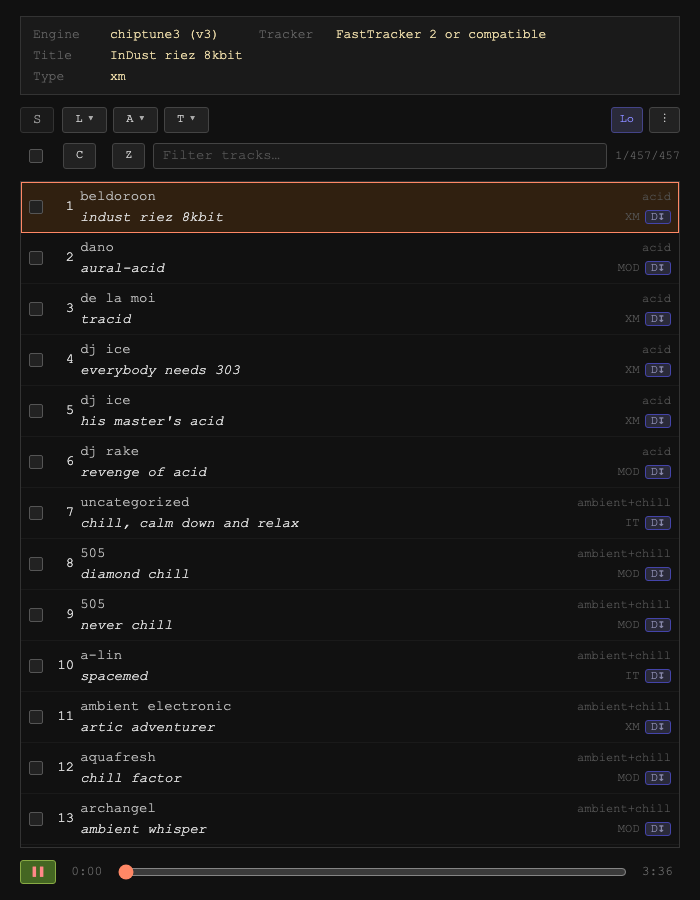

# ReTrap

<!-- AUTO:DOC_META:START -->
| Version | Updated |
|:--|:--|
| 0.9.8-6 | 2026-05-03 17:46 |
<!-- AUTO:DOC_META:END -->

A single-page browser-based chiptune player for the golden age of demoscene music, from C64 SID chips to Amiga tracker modules. It includes built-in local playlists and instant access to the Modland archive with 225K+ compatible tracker modules. Results can be narrowed with smart filters, and you can build your own custom lists from what you find.

No installs, no plugins, no nonsense. Just open a browser and press play.

Demo: [ReTrap](https://mike-seger.github.io/retro-tracker-players/)



## Quick Start

From this directory, start a local web server:

```bash
cd retro-tracker-players
python3 -m http.server 8080
```

Then open [localhost:8080](http://localhost:8080/) in your browser. All engines and tracks are available from that single page.

## Engines

The unified player loads three engines on demand:

| Engine | Format | Description |
|:----------|:----------|:---------------|
| **jsSID** | .sid | Pure-JS MOS 6510 CPU + SID chip emulator — three-voice synthesis, ring modulation, filters |
| **AHX** | .ahx | Abyss' Highest eXperience — four-voice Amiga wavetable synthesizer |
| **MOD** | .mod .xm .s3m .it | Classic tracker formats via libopenmpt |

## Features

- **Unified playlist** — all tracks from every engine merged into one alphabetically sorted list
- **Format filter** — multi-select dropdown to show only specific formats
- **Modland search** — switch to Modland mode to search and stream from the full Modland catalog
- **Instant playback** — click any track, or press Space
- **Searchable playlist** — filter tracks by name, artist, or filename
- **Refine dropdowns** — narrow results by folder, artist, and result range
- **Track selection** — checkbox-select individual tracks; bulk checkbox cycles all / none / restore
- **Copy to clipboard** — export selected track URLs as a newline-separated list
- **ZIP download** — download selected tracks as a `.zip` archive
- **Share / deep link** — the **S** button generates a URL encoding the current track and filter state
- **Auto-advance** — plays through the visible list continuously
- **Resume on reload** — offers to resume the last playing track with optional auto-resume
- **Keyboard-driven** — full control without touching the mouse
- **Touch gestures** — pinch to resize playlist font, swipe for prev/next
- **Installable PWA** — add to home screen on mobile for an app-like experience

## Tech

- **Zero dependencies at runtime** — no npm, no bundler, no framework
- **Vanilla JS ES modules** — source split across `js/` for maintainability; no build step
- **Web Audio API** — one AudioContext shared across all engines
- **Lazy engine loading** — each engine is imported only when its first track plays
- **Track cache** — fetched files are stored in the Cache API and served as blob URLs on repeat plays
- **Fully offline** — serve locally, no internet required after initial setup (except Modland search)
- **Modular engines** — each format lives under `engines/<id>/engine.js`; add a new format by dropping in an `engine.js` and `filelist.json`

## Debugging

- **Playing-track re-anchor logs** — toggle `DEBUG_TRACK_REANCHOR_LOG` in `js/app.js` to enable/disable URL-based list re-anchor diagnostics globally.

## Links
- [ModTube * Modland Webplayer & Research Tools](https://modtu.be/)
- [PlayMOD online player for various chiptune collections](https://www.wothke.ch/playmod/index.php)
- [Bassoon Fasttracker 2 Editor](https://www.stef.be/bassoontracker/)
- [Chip Player JS](https://chiptune.app/)
