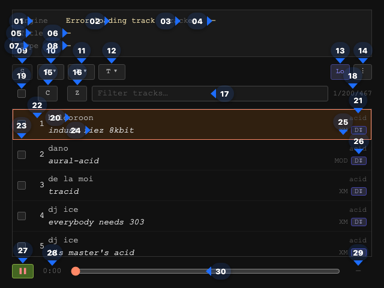

# ReTrap

<!-- AUTO:DOC_META:START -->
| Version | Updated |
|:--|:--|
| 0.9.9-15 | 2026-05-09 07:10 |
<!-- AUTO:DOC_META:END -->

A browser-based player for classic tracker module formats (MOD, XM, S3M, IT, AHX, SID) with local file lists and Modland search.

---

## User Interface

Description of the UI elements from the screenshot.

<!-- AUTO:UI_ELEMENT_TABLE:START -->

| # | Name | Selector |
|:--|:--|:--|
| 01 | Copy Engine value | html > body > div#player > div#info > div.info-field > span.label |
| 02 | Engine value | html > body > div#player > div#info > div.info-field > span.val |
| 03 | Copy Tracker value | html > body > div#player > div#info > div.info-field > span.label |
| 04 | Tracker value | html > body > div#player > div#info > div.info-field > span.val |
| 05 | Copy Title value | html > body > div#player > div#info > div.info-field > span.label |
| 06 | Title value | html > body > div#player > div#info > div.info-field > span.val |
| 07 | Copy Type value | html > body > div#player > div#info > div.info-field > span.label |
| 08 | Type value | html > body > div#player > div#info > div.info-field > span.val |
| 09 | Share / copy link | #share-btn |
| 10 | Select list | #refine-folder-btn |
| 11 | Select artist | #refine-artist-btn |
| 12 | Select format | #refine-format-btn |
| 13 | Source | #search-mode-btn |
| 14 | Options | #help-btn |
| 15 | Copy selected track links to clipboard | #btn-copy |
| 16 | Download selected tracks as ZIP | #btn-zip |
| 17 | Search tracks … | #filter |
| 18 | Track number / total found | #track-pos |
| 19 | Toggle all, none, or restore track selection | #sel-bulk-cb |
| 20 | Track artist | body > div#player > ul#playlist > li.remote > div.row-top > span.artist |
| 21 | Track group | body > div#player > ul#playlist > li.remote > div.row-top > span.folder |
| 22 | Track index | html > body > div#player > ul#playlist > li.remote > span.idx |
| 23 | Track selector checkbox | html > body > div#player > ul#playlist > li.remote > input.sel-cb |
| 24 | Track title | body > div#player > ul#playlist > li.remote > div.row-bot > span.title |
| 25 | Track format | body > div#player > ul#playlist > li.remote > div.row-bot > span.ext |
| 26 | Download track | body > div#player > ul#playlist > li.remote > div.row-bot > button.r-dl |
| 27 | Play / Pause | #btn-play |
| 28 | Track Time | #time |
| 29 | Track Length | #duration |
| 30 | Track seekbar | #seek |
| 31 | Browse random tracks | #ml-random |
| 32 | Result page | #refine-range-btn |
| 33 | Add all search results | #ml-add-all |
| 34 | Add track | button.r-add (first row) |

<!-- AUTO:UI_ELEMENT_TABLE:END -->

## Keyboard Shortcuts

### Playback & Navigation

| Key | Action |
|:-----|:-----|
| <kbd>Space</kbd> | Play / Pause |
| <kbd>↑</kbd> / <kbd>↓</kbd> | Previous / next track |
| <kbd>←</kbd> / <kbd>→</kbd> | Seek back / forward 5 s |
| <kbd>Enter</kbd> | Play focused track |
| <kbd>Shift+Enter</kbd> | Toggle selection on focused track |
| <kbd>/</kbd> | Focus the search / filter box |
| <kbd>s</kbd> | Share / copy link |
| <kbd>c</kbd> | Copy selected file URLs to clipboard |
| <kbd>z</kbd> | Download selected tracks as ZIP |
| <kbd>r</kbd> | Random Modland track (Modland mode) |
| <kbd>l</kbd> | Toggle List filter dropdown |
| <kbd>a</kbd> | Toggle Artist filter dropdown |
| <kbd>t</kbd> | Toggle Format / Type filter dropdown |
| <kbd>x</kbd> | Clear search filter |
| <kbd>?</kbd> | Help overlay |
| <kbd>Esc</kbd> | Blur search / close help / close dropdown |

> Shortcuts are suppressed while the cursor is inside a text input, select, or textarea.

### Inside a Dropdown (L / A / T / Range)

| Key | Action |
|:-----|:-----|
| <kbd>↑</kbd> / <kbd>↓</kbd> | Navigate between items (wraps) |
| <kbd>Space</kbd> | Toggle focused checkbox; select focused range entry |
| <kbd>Enter</kbd> | Accept selection and close dropdown |
| <kbd>Esc</kbd> | Undo all changes since the dropdown opened and close |

Opening a dropdown automatically closes any other open dropdown.

### Toolbar

| Key | Action |
|:-----|:-----|
| <kbd>S</kbd> | Share (copy deep-link URL) |
| <kbd>C</kbd> | Copy selected file URLs to clipboard |
| <kbd>Z</kbd> | Download selected tracks as ZIP |
| <kbd>R</kbd> | Random (shuffle a slice of the index) |
| <kbd>+</kbd> | Add all visible Modland results to saved list |
| <kbd>-</kbd> | Delete all visible saved Modland tracks |
| <kbd>L</kbd> | Open / close List filter |
| <kbd>A</kbd> | Open / close Artist filter |
| <kbd>T</kbd> | Open / close Format filter |
| <kbd>?</kbd> | Open / close Help |
| <kbd>X</kbd> | Clear active filter |

### Modland Rows

| Key | Action |
|:-----|:-----|
| <kbd>Enter</kbd> | Add focused search-result row to saved list |
| <kbd>Backspace</kbd> / <kbd>Delete</kbd> | Remove focused saved-list row |

### Dropdown Panels

| Key | Action |
|:-----|:-----|
| <kbd>↑</kbd> / <kbd>↓</kbd> | Move focus between options |
| <kbd>Space</kbd> | Toggle checkbox / select option |
| <kbd>Enter</kbd> | Accept selection and close panel |
| <kbd>Esc</kbd> | Undo changes and close panel |

### Confirmation Dialogs

| Key | Action |
|:-----|:-----|
| <kbd>Tab</kbd> / <kbd>Shift+Tab</kbd> | Cycle between Yes and No buttons |
| <kbd>←</kbd> / <kbd>→</kbd> | Move between Yes and No buttons |
| <kbd>Enter</kbd> | Activate focused button |
| <kbd>Esc</kbd> | Cancel (same as No) |

---

## Modes

### Local mode
Shows tracks and playlists bundled with the app (MOD, AHX, SID files).  
Use **List**, **Artist**, and **Format** dropdowns to narrow the list.

### Modland mode
Searches the [Modland](https://modland.com) remote index (loaded once per session).  
Type at least 2 characters in the search box, or pick a list from the dropdown.

- **+** button on a result: save it to your personal Modland list.
- **Add all**: save all current search results to your list.
- **Random**: browse a random shuffled slice of the full index.
- **Del all**: remove visible tracks from your list (with confirmation).
- Double-tap or long-press a track to search Modland for that artist.

---

## Selection & Export

- Click the **checkbox** at the far left of any track to select it.
- Use <kbd>Enter</kbd> / <kbd>Shift+Enter</kbd> to play or toggle selection on the focused track.
- Use the **bulk checkbox** (top-left of the list) to cycle: all → none → restore previous selection.
- **C** button: copy selected file links to clipboard (double-quoted, comma-separated).
- **Z** button: download selected tracks as a **.zip** archive (remote tracks include a `urllist.json`).

---

## Deep Links

The **S** (share) button generates a URL that encodes the current track and filter state.  
Sharing or bookmarking this URL lets you jump straight back to the same track and context.

| Parameter | Description | Example |
|:-----|:-----|:-----|
| `play` | URL of the track to load | `play=engines/mod/files/…` |
| `source` | Pre-select source mode | `source=modland` |
| `folders` | Pre-select lists | `folders=trance` |
| `artists` | Pre-select artists | `artists=dct2` |
| `formats` | Pre-select formats | `formats=mod,xm` |
| `search` | Pre-fill the search / filter input | `search=trance` |

---

## Touch Gestures

| Gesture | Action |
|:-----|:-----|
| Swipe left on playlist | Next track |
| Swipe right on playlist | Previous track |
| Pinch on playlist | Resize track list font |
| Long-press a track | Search Modland for that artist |
| Double-tap a track | Search Modland for that artist |

---

## Resume

When you reload the page, a prompt offers to resume where you left off.  
Check **Always resume automatically** to skip the prompt in future sessions.

---

## Debug Log

Double-click (or long-press) the transport bar to reveal a rolling debug/timing log.  
Long-press the log to copy or share its contents.

---

## Development

The source of this app is available here: [retro-tracker-players](https://github.com/mike-seger/retro-tracker-players)
