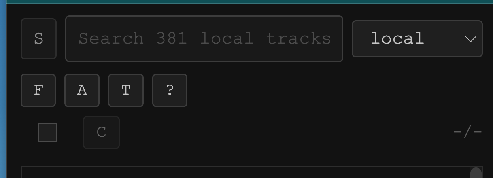

- confirmation dialog with add all (+)
- header controls should be in a single row () even in mobile mode
- cannot resume audio on iOS after screen lock (broken). it can be resolve by manually reloading the page. can this be automated? if the unlock can be detected, maybe a resume audio confirmation dialog could do the trick
- an empty (multi-)select button should be display:none, e.g. when there is no range see (-select-empty.png)

